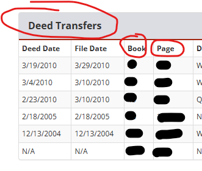

# Izard County - Arkansas Land Investors Cheatsheet

## Purpose
The purpose of the is cheatsheet is to help land investors new to Izard County, Arkansas get up to speed on how to get set-up, find information for due diligence and document key contacts. 

## Key Contacts

### General 
* [Izard County Website](https://www.izardcountyar.org/)
### Due Diligence

#### County Assessor - Phone: 870-368-7810
* [County Assessor Site](https://www.izardcountyar.org/assessor)
* [Parcel Research](https://www.actdatascout.com/TaxCollector/Arkansas/Izard)
    * **Make sure to select Real Estate Tab**

#### Tax Collector - Phone: 870-368-7247
* [Tax Collector Site](https://www.izardcountyar.org/tax-collector)
* [Parcel Tax Research](https://www.actdatascout.com/TaxCollector/Arkansas/Izard)
    * **Make sure to select Tax Records/Pay Taxes Tab**

##### DELINQUENT TAXES

**Delinquent taxes may be turned over from the County to the State!!!!**
To check on collections at the state and to pay back taxes go to
* [State of Arkansas Commissioner of State Lands](https://www.cosl.org/Home/Search)
* COSL Phone: 501-324-9422 

**You will need to obtain a redemption Deed to be be able to record with izard County Clerk**
**Make sure** that you update the name with COSL for the redemption deed to ensure it is mailed to you and not the previous owner.

#### County Clerk (Recorder) - Phone: 870-368-4316
* [County Clerk Site](https://www.izardcountyar.org/circuit-county-clerk)

##### Address for recording
Izard County Clerk
PO BOX 95
Melbourne, AR 72556

##### Deed Research
Deeds are looked up by Book and Page.  Book and Page numbers are located during parcel research on the Assessor site.

**How to request deeds**
 
* Method 1 - Call the clerks office and ask for deed by book and page.
    * The will need you email address to send the tif file
* Method 2 **(Preferred)** - email the county clerk office with the deeds you require.  They will pull the deeds and send to you via email.  Don't forget to check you junk folder or Other tab(outlook) as their address is a gmail and might not get to your focused inbox.

|          |          |
|----------|----------|
|Email Address| izardcountyrecords@gmail.com|
|Email Subject|  Deed Look Ups|
|Email Body Template Header|  Dear County Clerk,  When time permits can you please pull me copies of the deeds for the following:  
|Email Body Deed Request|  PARCEL 1 PARCEL 2 PARCEL N  **See template below**
|Email Footer|Regards,  {Your Name}

**PARCEL DEED REQUEST TEMPLATE**

**Owner:** {Owner1 Name} \*

**APN:** {APN Number}

**Parcel Address:** {Parcel Address}
|Book|Page|
|-----|-----|
|XXX|YYY|

**\*** - Not sure that Owner, APN or parcel address are needed but alway better to have just in case. IMHO.

#### CITY RESEARCH

##### Horseshoe Bend

###### Business License Requirement
Horseshoe Bend requires you to obtain a City Business License.  This license can be obtained by filling out the following form:

* [APPLICATION FOR CITY BUSINESS LICENSE](https://cityofhorseshoebend.wordpress.com/wp-content/uploads/2018/11/bus_lic_app.pdf)

###### Planning and Zoning and Other Information
* Contact:  Mary 
* Websites: 
    * [City Hall](https://www.horseshoebend.org/city-hall.html)
    * [City of Horseshoe Bend](https://cityofhorseshoebend.wordpress.com/)
* [City of Horseshoe Bend Facebook Page](https://www.facebook.com/cityhsb/) 
* Phone: 870-670-5113 
* Email: cityhall@cityofhorseshoebendar.gov

If you have general questions or question on zoning Mary can help.  If you need zoning info Best bet is to email her at the above email and provide here the addresses you have questions about.

###### Subdivision Restrictions and Covenants

* [Horseshoe Bend Bills of Assurance](https://hbarfoia.org/property-deed-bldg-permits-etc)

###### Water and Sewer
* Phone: 870-670-5885 
* Email: [water@cityhsb.org](mailto:water@cityhsb.org)

You can email water questions to the above email.

###### Electricity - North Arkansas electric coop
* Phone: 870-895-3221
* Website: [www.naeci.com](https://www.naeci.com/)

### Deed Recording Process

1.  Obtain the signed and notarized deed
2.  A copy of a valid government-issued photo identification card or driver's license for the Grantor or person who sighned on behalf of the Grantor **(SEE NOTE BELOW)**
2.  Go to the ATAP Site and pay the real estate transfer tax
3.  Print out the real estate transfer tax stamp
4.  Contact Arkansas Commissioner of State Lands and **pay any back taxes** on the parcel
    * You can call or use website to update the parcel information to enure the release deed is sent back to county in your name.  They will need copy of your current deed and you can pay the back taxes.
        * [COSL Website](https://www.cosl.org/Home/Search)
        * Phone: 501-324-9422
5.  Mail recording documents to Izard County Clerk (**See Below**)
   
**######################################################################################**
#### New ID requirement as of 8/5/2025
**##################################### BEGIN ##########################################**

According to **Act 752 of 2025**, passed by the Arkansas General Assembly, the person who signed on behalf of the grantor must prove their identity by presenting with the deed a valid government-issued photo identification card or driver's license if recording in person, or enclose a photocopy of a valid identification card or driver's license if recording by mait.

Deeds recorded in person or by mai[ that are not accompanied by an identification card or driver's license proving the identity of the grantor or person who signed the deed on behalf of the grantor will be rejected.

This requirement does not apply to:

Deeds that are electronically recorded through the county's e-recording system or

Deeds recorded by:

* An attorney

* Real estate broker or agent

* Representative of a bank, mortgage company, or lending institution

* Title insurance agent, agency, or person affiliated with a title insurance agency

* The Commissioner of State Lands

* A person representing the state or a political subdivision of the state

* The state, an Arkansas municipality or political subdivision of the state.

Not confirmed for Izard County, Ar but other counties Ar state copies of IDs will be kept under seal and never available to the public. 
* Contact Izard County Clerk to confirm.
**##################################### END ##########################################**

#### Mail To
Izard County Clerk
PO BOX 95
Melbourne, AR 72556

* Include in mail package to the County Clerk
    * Wet Copies of the Signed and Notarized Deeds
    * Tax Stamp - [Arkansas Taxpayer Access Point](https://atap.arkansas.gov/_/#1)
        * You need to pay taxes on the purchase to [Purchase Real Estate Transfer Stamp](https://atap.arkansas.gov/_/#3)
        * See below on getting set-up an account setup in the Arkansas Taxpayer Access Point Site
    * Self addressed stamped envelope for the clerks to send your recorded deed back to you
* Pricing
    * $15 First page
    * $5 each additional page
        * **NOTE:** Tax Stamp counts as a page
        * I need to call to see if they require you to also include trust documents when recording a sale from a trust.

#### Arkansas Taxpayer Access Point Account(ATAP) set-up
You need to set-up and account in the ATAP site to be able to pay taxes and obtain your Real Estate Tax Transfer Stamp.

**NOTE:**  If you don't have an LLC set-up yet you may have to do the process twice.  Once for your personal account then again once you have all you LLC infomration.

##### ATAP Onboarding process

1.  Fill out the [REAL ESTATE TRANSFER STAMP REGISTRATION & UPDATE FORM](./documents/RET-Registration%20Form.pdf)
2.  Send copy of form to [iris.slaton@dfa.arkansas.gov](mailto:iris.slaton@dfa.arkansas.gov)
3.  Iris should get back to you in a day or two with your account information to complete the account onboarding on the site
    * [www.atap.arkansas.gov](https://atap.arkansas.gov/) 
        * Please follow these steps:
            1. Click "Sign Up."
            2. Click "Next."
            3. Select "Administrator Login."

    

